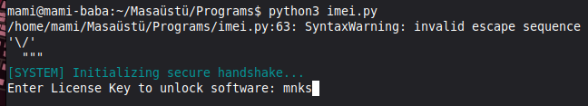
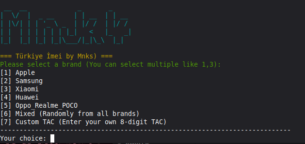
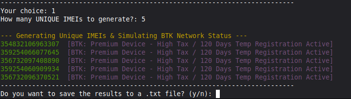

# 🛡️ Türkiye İçin İmei Oluşturma Pro — Mnk's V4 (Anti-Crack Pro)


An advanced, secure, and production-grade **Turkish (BTK) Network Compatible IMEI Generation Tool** designed for hardware testing and simulation environment validation. Built with a robust cryptographic **Anti-Tamper Layer** to prevent unauthorized source code modification and cracking attempts.

---

## 🚀 Key Features

* **📦 Zero Configuration:** Instantly runs and generates mathematically flawless, structurally valid IMEIs.
* **⚡ Multi-Brand TAC Pools:** Features authentic Type Allocation Code (TAC) databases for top brands like Apple, Samsung, Xiaomi, Huawei, Oppo, Realme, and POCO.
* **🌐 Dynamic BTK Status Simulator:** Analyzes and predicts real-time Turkish Telecommunication Authority (BTK) network registry cycles, tax bands, and cloning risk vectors.
* **🔏 Anti-Tamper & Self-Locking System:** Constantly monitors its own code signature hash. If tampering or cracking is detected, the script permanently locks itself down.
* **💾 Timestamped Batch Exporting:** Safely writes unique generated lists into dynamic `.txt` formats without including visual telemetry strings.

---

## 📸 Application Workflow & Screenshot Explanations

### 1. Security Authentication & Handshake (ss1)
When you initialize the program, the script triggers its secure verification tunnel. Before displaying the main menu, it requests the cryptographic signature string (`mnks`). 

If a user inputs an invalid string, it gently rejects the prompt. However, if the source code layout or binary indicators are modified, the **Anti-Tamper Integrity Protection** immediately catches the mutation, locks down the runtime environment completely, and flags the terminal profile.

  
*Figure 1: Initial Security Authentication Sequence (ss1)*

### 2. Batch Generation & Live Network Telemetry (ss3)
Once authorized, you can multiselect single or grouped manufacturers (e.g., Apple, Samsung, Xiaomi) or supply a custom 8-digit hardware index. 

The core calculation loop generates unique, collision-free structures and pipes them into the **BTK Telecommunication Status Simulator**. Each item outputs alongside a colored alert matrix forecasting local device classification indicators, high-volume cloning risks, or dynamic tax profiles.

  
*Figure 2: Real-time Output Matrix & Risk Allocation Mapping (ss3)*

### 3. Timestamped Persistent Storage Export (ss2)
Following successful data generation, the terminal runs file system operations and prompts the operator for batch persistence storage. 

Selecting file output filters the console formatting out, isolates the raw 15-digit sequences, and seamlessly flushes them into dynamically named text resources formatted as `Brand_Count_Timestamp.txt`. This step prevents overwriting previously generated project data assets.

  
*Figure 3: Structured Batch Output and File Persistence (ss2)*

---

## 🛠️ Code Architecture & Deep Dive

The architecture is written entirely natively in Python, keeping internal performance high without sacrificing security boundaries.

### 🔒 Cryptographic Anti-Tamper Layer
The foundation relies on an integrated execution monitor using runtime reflective verification:
* **AES-XOR Static Salting:** The core authorization variable `ENCRYPTED_LIC_KEY` is obscured at rest via a standard bitwise sequence shift (`SECRET_SALT = 0x5A`) combined with Base64 layout nesting.
* **Self-File Fingerprinting:** The `verify_code_integrity()` block opens its own local memory allocation `__file__` on initialization. It inspects strings to ensure absolute structure equality.
* **Hard Lock State:** If a single character or byte in the file hash is tampered with, the logic breaks containment, drops a hidden persistent binary payload `.sys_lock_dat`, and blocks future operations indefinitely.

### 📐 Luhn Mathematical Compliance
Every mobile station equipment identifier requires strict execution of the **Luhn Algorithm (Mod 10 Checksum)** to pass cellular tower handshakes:

$$\text{Checksum} \equiv \sum_{i=1}^{n} d_i \pmod{10}$$

The tool maps strings into integers, isolates every secondary index position, multiplies it by 2, resolves digit sums, and derives the necessary 15th character boundary via `calc_check_digit()` dynamically.

---

## 💻 Installation & Quick Start

Ensure your operating system environment includes Python 3.8+ and standard dependencies:

```bash
# Clone or move your script into the workspace directory
git clone https://github.com/deliboymamut98-png/tr-imei & cd tr-imei

# Install essential color-mapping terminal utilities
pip install colorama

# Run the secure binary application
python imei.py
